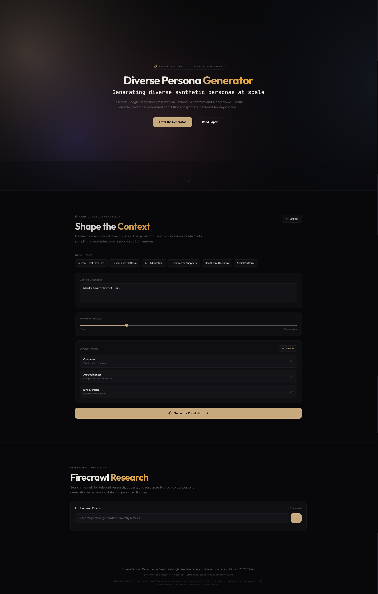

# Diverse Persona Generator 

> **Generating Diverse Synthetic Personas at Scale** — An interactive, cinematic web application that transforms cutting-edge AI research into a production-ready tool for creating diverse, representative synthetic user populations.



---

## 📋 Table of Contents

1. [What is Diverse Persona Generator?](#what-is-personaforge)
2. [Why Should You Care?](#why-should-you-care)
3. [The Research Behind It](#the-research-behind-it)
4. [Quick Start (5 Minutes)](#quick-start-5-minutes)
5. [Step-by-Step Usage Guide](#step-by-step-usage-guide)
6. [Understanding the Features](#understanding-the-features)
7. [Architecture for Developers](#architecture-for-developers)
8. [Project Structure](#project-structure)
9. [Troubleshooting](#troubleshooting)
10. [Tech Stack & Dependencies](#tech-stack--dependencies)

---

## What is Diverse Persona Generator?

**Diverse Persona Generator** is a web application that lets you create **diverse populations of synthetic personas** — realistic virtual people with unique backgrounds, traits, attitudes, and behavioral patterns.

Imagine you are building:
- A mental health chatbot and need to test it with 50 different types of users
- An educational platform and want to understand how different students might interact
- A social media app and need representative user profiles for testing

**Diverse Persona Generator generates these personas for you** — not random, cookie-cutter profiles, but **maximally diverse populations** that cover the full spectrum of human variation. It uses a two-stage generation algorithm (inspired by Google DeepMind research) to ensure your persona population is statistically representative, not just a cluster of similar profiles.

### The Core Idea

Instead of manually writing 20 user personas (which tend to all look alike after the 5th one), you:
1. **Define the scenario** (e.g., "Users of a mental health support chatbot")
2. **Choose diversity axes** (e.g., Trust in AI, Symptom Severity, Tech Literacy)
3. **Set population size** (5 to 100 personas)
4. **Click Generate** — and get a fully diverse population with detailed profiles

---

## Why Should You Care?

### For Product Managers & UX Researchers
- **Stop the "5 personas trap"** — most teams create 5 personas and call it done. Diverse Persona Generator generates statistically diverse populations that surface edge cases you would never think of manually.
- **Test inclusivity** — ensure your product works for rare combinations of traits (e.g., a highly tech-literate user with severe symptoms and low trust in AI).
- **Save weeks of work** — what takes a research team 2-3 weeks of interviews and synthesis takes 30 seconds with Diverse Persona Generator.

### For AI Engineers & Data Scientists
- **Ground LLM evaluations in realistic populations** — test your model against 100 distinct persona types instead of generic prompts.
- **Generate training data** — synthetic personas can drive role-play conversations, preference datasets, and red-teaming scenarios.
- **Measure coverage** — the built-in diversity dashboard quantifies how well your population covers the possibility space.

### For Junior Developers Learning AI
- **See research in action** — this app implements a real 2026 research paper from Google DeepMind with production-grade code.
- **Learn modern React patterns** — Zustand state management, Canvas 2D graphics, custom hooks, and cinematic UI effects.
- **Understand diversity metrics** — Coverage, Convex Hull Volume, KL Divergence, and more.

---

## The Research Behind It

Diverse Persona Generator is based on the paper:

> **"Persona Generators: Generating Diverse Synthetic Personas at Scale"**  
> Authors: Paglieri et al., Google DeepMind  
> arXiv: [2602.03545v1](https://arxiv.org/abs/2602.03545) (2026)

### Key Research Concepts Implemented

| Concept | What It Means | How Diverse Persona Generator Uses It |
|---------|---------------|--------------------------|
| **Two-Stage Generation** | First generate high-level descriptors, then expand into full profiles | Stage 1 creates axis values; Stage 2 adds backgrounds, traits, names, avatars |
| **Quasi-Random Sampling** | Use deterministic low-discrepancy sequences (Halton-like) for better coverage than pure randomness | Seeded golden-ratio-based sampling ensures even distribution across the space |
| **Coverage Metric** | Monte Carlo estimate of how much of the possibility space your personas cover | Displays as a percentage on the diversity dashboard |
| **Convex Hull Volume** | Volume of the bounding box in the embedding space | Larger = more diverse population |
| **Dispersion** | Largest empty region between personas | Smaller = better coverage, fewer gaps |

---

## Quick Start (5 Minutes)

### Prerequisites
- **Node.js 20+** installed ([download here](https://nodejs.org/))
- A terminal (Terminal on macOS, PowerShell on Windows, or any Linux terminal)

### Step 1: Clone or Navigate to the Project
```bash
cd Diverse-Persona-Generator
```

### Step 2: Make Scripts Executable (First Time Only)
```bash
chmod +x start.sh stop.sh
```

### Step 3: Start the Application
```bash
./start.sh
```

The script will:
1. Detect your operating system
2. Check Node.js is installed
3. Install pnpm (fast package manager) if missing
4. Install all dependencies automatically
5. Start the dev server

### Step 4: Open Your Browser
Navigate to: **http://localhost:4321**

You should see the cinematic dark-themed Diverse Persona Generator interface.

### Step 5: Stop the Application
When you're done, press `Ctrl+C` in the terminal, or run:
```bash
./stop.sh
```

---

## Step-by-Step Usage Guide

### 1. The Hero Section
When you first load the app, you'll see:
- An **animated mesh gradient background** (living, breathing colors)
- A **scramble text reveal** — the subtitle decodes character by character like a terminal
- Two buttons: **"Enter the Generator"** and **"Read Paper"**

Click **"Enter the Generator"** to scroll down to the configuration panel.

### 2. Configure Your Context (The Forge Section)

#### Choose a Preset (Fastest Way)
Click one of the **Quick Presets**:
- 🧠 **Mental Health Chatbot** — Users interacting with an AI mental health assistant
- 📚 **Educational Platform** — Students using an AI tutoring system
- 🤖 **AGI Adaptation** — Workers adapting to AGI in their workplace
- 🛒 **E-commerce Shoppers** — Online shoppers during holiday season
- 🏥 **Healthcare Decisions** — Patients making health-related choices
- 💬 **Social Platform** — Users of a social media platform

Each preset automatically fills in:
- A context description
- Three relevant diversity axes

#### Or Write Your Own Context
In the **Context Description** text area, describe your scenario. For example:
> "First-time homebuyers exploring mortgage options through a mobile banking app"

#### Set Population Size
Use the slider to choose how many personas to generate:
- **Small (5-15)** — Quick exploration, focus on extremes
- **Medium (20-50)** — Balanced coverage for most projects
- **Large (75-100)** — Maximum diversity for research or AI training

#### Customize Diversity Axes
Diversity axes are the dimensions along which your personas should vary. Each axis has:
- **Name** (e.g., "Risk Tolerance")
- **Low label** (e.g., "Risk-Averse")
- **High label** (e.g., "Risk-Seeking")

You can:
- **Add axes** with the "Add Axis" button
- **Remove axes** (minimum 2 required) with the X button
- **Use defaults** by selecting a preset

### 3. Generate the Population
Click the big **"Generate Population"** button. You'll see:
- A progress bar filling up
- Status updates as personas are created
- The page auto-scrolls to the explorer when done

**What happens under the hood:**
1. **Stage 1** — Quasi-random sampling generates axis values using a deterministic low-discrepancy sequence (based on the golden ratio constant). This ensures even coverage, not clumping.
2. **Stage 2** — Each high-level descriptor is expanded into a full persona with:
   - Realistic name (from diverse name pools)
   - Avatar (auto-generated SVG from DiceBear API)
   - Background story (template-based with randomized details)
   - Personality traits (mapped from axis values)
   - Natural language summary

### 4. Explore in 3D (Population Explorer)

After generation, you'll see an **interactive 3D scatter plot** showing all your personas as points in space.

#### How to Interact:
| Action | Result |
|--------|--------|
| **Drag** | Rotate the 3D view |
| **Hover** | See persona name glow and preview |
| **Click** | Open full persona detail panel |
| **Toggle Labels** | Show/hide name labels with the eye button |

#### The Detail Panel
When you click a persona, a side panel opens showing:
- **Avatar & Name** — Visual identity
- **Stage 1 Descriptor** — High-level summary (e.g., "Trusting | High Literacy")
- **Summary** — Natural language description
- **Background** — Life story with education, work, living situation
- **Traits** — Personality tags derived from axis values
- **Axis Bars** — Visual sliders showing where this persona sits on each axis

### 5. Analyze Diversity (Diversity Dashboard)

Scroll down to see **six animated metric cards** that quantify your population's diversity:

1. **Coverage** — What % of the possibility space is covered (Monte Carlo estimate)
2. **Convex Hull Volume** — Volume of the bounding box (larger = more spread out)
3. **Min Pairwise Distance** — Distance between closest personas (larger = less redundancy)
4. **Avg Pairwise Distance** — Mean separation across all pairs
5. **Dispersion** — Largest gap between any persona and its nearest neighbor (smaller = better)
6. **KL Divergence** — Distance from a uniform distribution (closer to 0 = more balanced)

**Animated Counters** — Numbers count up from 0 when you scroll into view.

**Radar Chart** — A hexagonal radar chart visualizes all six metrics simultaneously, with an **Overall Score** percentage.

> **Tip:** If your coverage is below 40%, try increasing population size or adding more axes.

### 6. Research Augmentation (Firecrawl Panel)

At the bottom, there's a **Firecrawl Research panel** where you can search for relevant papers, articles, and resources to ground your persona generation in real-world data.

> **Note:** The research feature is currently a **simulated demo** using hardcoded mock results. It demonstrates the UI/UX of what a Firecrawl MCP-powered search would look like, but does not yet call the actual Firecrawl API.

Type a topic (e.g., "mental health chatbot user demographics") to see example results. In a production setup, this panel would integrate with the [Firecrawl MCP server](https://github.com/mendableai/firecrawl-mcp-server) to perform live web searches and extract real research papers.

#### How Personas Are Generated (No AI Tool, No Database)

A common question: **"How does this actually generate personas? Is there an AI model? A database?"**

**No — persona generation is 100% client-side using deterministic algorithms.** Here's exactly what happens:

| Aspect | How It Works |
|--------|-------------|
| **No LLM / No AI API** | There is no call to ChatGPT, Claude, or any language model. Personas are built algorithmically. |
| **No Database** | No SQLite, no PostgreSQL, no cloud storage. All data lives in-memory during your session. |
| **Deterministic Seeding** | Every persona is generated from a mathematical seed. The same inputs always produce the same outputs. |
| **Quasi-Random Sampling** | Stage 1 uses a low-discrepancy sequence (based on the golden ratio, similar to Halton sequences) to ensure even coverage across diversity axes — better than pure randomness. |
| **Template Expansion** | Stage 2 fills in pre-written templates with randomized selections from curated pools: names (32 first × 24 last = 768 combinations), traits (55 personality descriptors), occupations (8), educations (4), backgrounds (4 templates), and hobbies (6). |
| **Avatars** | SVG avatars are generated by the [DiceBear API](https://dicebear.com) using the persona's seed, so each persona gets a unique but deterministic visual identity. |

The entire generation pipeline is in `src/utils/personaGenerator.ts` — approximately 250 lines of TypeScript. You can read every line to understand exactly how your personas are created.

#### How to Configure Firecrawl for Live Research (Optional)

To connect the research panel to real web search, you would need to:

1. **Install the Firecrawl MCP server**:
   ```bash
   npx -y firecrawl-mcp
   ```

2. **Add your Firecrawl API key** to a `.env` file:
   ```bash
   FIRECRAWL_API_KEY=your_api_key_here
   ```

3. **Replace the simulated `handleSearch` function** in `src/components/shared/ResearchPanel.tsx` with actual Firecrawl MCP tool calls (e.g., `firecrawl_search` or `firecrawl_scrape`).

The MCP server provides tools like `firecrawl_scrape`, `firecrawl_search`, `firecrawl_map`, and `firecrawl_crawl` for real-time web research integration.

---

## Understanding the Features

### Cinematic UI Effects

| Feature | What You See | Technical Implementation |
|---------|-----------|------------------------|
| **Mesh Gradient Background** | Animated, living color blobs behind the hero | Canvas 2D with radial gradients and `lighter` composite |
| **Scramble Text Decode** | Characters scramble and lock into place one by one | `requestAnimationFrame` with random character pool |
| **Scroll-Driven Reveals** | Sections fade in as you scroll | Intersection Observer API with CSS transitions |
| **Animated Counters** | Metrics count up from 0 | `requestAnimationFrame` with cubic ease-out |
| **3D Scatter Plot** | Draggable 3D point cloud | Canvas 2D with manual 3D→2D projection, depth sorting |

### The Generation Algorithm

```
┌─────────────────┐     ┌──────────────────┐     ┌─────────────────┐
│  User Config    │────▶│  Stage 1:        │────▶│  Stage 2:       │
│  (axes, size)   │     │  High-Level      │     │  Full Expansion │
│                 │     │  Descriptors     │     │                 │
└─────────────────┘     └──────────────────┘     └─────────────────┘
                              │                          │
                              ▼                          ▼
                        Quasi-random                Name + Avatar
                        sampling                  Background story
                        (golden ratio              Trait mapping
                         constants)                Summary text
                              │
                              ▼
                    ┌─────────────────┐
                    │  Embedding      │
                    │  [0.42, 0.85,   │
                    │   0.12, ...]    │
                    └─────────────────┘
```

---

## Architecture for Developers

### Tech Stack

| Layer | Technology | Version | Why |
|-------|-----------|---------|-----|
| **Build Tool** | Vite | 8.0.9 | Lightning-fast HMR, Oxc-based compilation (no Babel) |
| **Framework** | React | 19.2.5 | Server Components, Actions, latest hooks |
| **Language** | TypeScript | 6.0.3 | Strict type safety |
| **State** | Zustand | 5.0.12 | Minimal, hooks-based state management |
| **Styling** | Pure CSS | — | Custom properties, no Tailwind overhead |
| **Icons** | Lucide React | 0.474.0 | Tree-shakeable SVG icons |
| **Math/Vis** | D3 | 7.9.0 | Scale functions, data transformations |
| **Animation** | GSAP | 3.15.0 | Timeline control (reserved for future effects) |

### Key Design Decisions

**No Tailwind CSS** — We use pure CSS custom properties for the Generator Dark design system. This avoids the `~30KB` Tailwind runtime and gives us pixel-perfect control over the cinematic aesthetic.

**No Three.js for the 3D Plot** — The scatter plot is implemented with raw Canvas 2D and manual 3D→2D projection. This keeps the bundle smaller and proves you don't need a heavy library for simple 3D visualization.

**No Babel** — Vite 8's `@vitejs/plugin-react` v6 uses the Oxc compiler (Rust-based). Faster builds, smaller bundles.

**pnpm over npm** — Disk-efficient, strict lockfiles, faster installs.

### State Management (Zustand)

The app uses a single Zustand store (`personaStore.ts`) with the following state:

```typescript
interface PersonaState {
  population: Persona[]           // All generated personas
  selectedPersona: Persona | null // Currently selected in explorer
  metrics: DiversityMetrics | null // Computed diversity scores
  isGenerating: boolean           // Generation in progress
  generationProgress: number      // 0-100
  config: GenerationConfig        // User's current configuration
}
```

Actions are simple setter functions — no reducers, no boilerplate.

---

## Project Structure

```
Diverse-Persona-Generator/
├── start.sh              # One-command startup script
├── stop.sh               # Graceful shutdown script
├── package.json          # Dependencies (verified live against npm)
├── vite.config.ts        # Vite 8 config (Oxc, no Babel)
├── tsconfig.json         # TypeScript strict mode
├── index.html            # Entry point with Google Fonts
├── src/
│   ├── main.tsx          # React root renderer
│   ├── App.tsx           # Main layout composer
│   ├── index.css         # Generator Dark design system
│   ├── vite-env.d.ts     # Vite type declarations
│   ├── types/
│   │   └── index.ts      # Persona, DiversityAxis, Metrics types
│   ├── stores/
│   │   └── personaStore.ts  # Zustand global state
│   ├── utils/
│   │   └── personaGenerator.ts  # Core two-stage algorithm
│   └── components/
│       ├── forge/
│       │   ├── HeroSection.tsx      # Mesh background + scramble text
│       │   ├── GeneratorSection.tsx     # Configuration panel
│       │   ├── MeshBackground.tsx   # Canvas 2D animated gradient
│       │   └── ScrambleText.tsx     # Character decode animation
│       ├── explorer/
│       │   └── PopulationExplorer.tsx  # 3D scatter plot + detail panel
│       ├── dashboard/
│       │   └── DiversityDashboard.tsx  # 6 metrics + radar chart
│       └── shared/
│           └── ResearchPanel.tsx    # Firecrawl research integration
```

---

## Troubleshooting

### "Port 4321 is already in use"
```bash
./stop.sh
# Then:
./start.sh
```

### "Node.js not found"
Install Node.js 20+ from [nodejs.org](https://nodejs.org/). Verify with:
```bash
node --version  # Should show v20.x.x or higher
```

### "pnpm not found"
The `start.sh` script auto-installs pnpm. If it fails:
```bash
npm install -g pnpm
```

### Blank white screen
1. Check the browser console (F12 → Console) for errors
2. Ensure dependencies are installed: `pnpm install`
3. Try a hard refresh: `Ctrl+Shift+R` (or `Cmd+Shift+R` on Mac)

### Build errors
```bash
pnpm run build
```
If TypeScript errors appear, they are usually related to missing types. Ensure `@types/react` and `@types/react-dom` are installed (they are in `devDependencies`).

### The 3D plot is laggy
The Canvas 2D renderer is optimized for ~50 personas. For 100+ personas, the frame rate may drop on older GPUs. Reduce population size or close other browser tabs.

---

## Tech Stack & Dependencies

All versions were **verified live against the npm registry** using the `dependency-guard` skill:

| Package | Version | Purpose |
|---------|---------|---------|
| `vite` | 8.0.9 | Build tool & dev server |
| `@vitejs/plugin-react` | 6.0.1 | Oxc-based React compilation |
| `react` | 19.2.5 | UI framework |
| `react-dom` | 19.2.5 | React DOM renderer |
| `typescript` | 6.0.3 | Type system |
| `zustand` | 5.0.12 | State management |
| `lucide-react` | 0.474.0 | Icons |
| `d3` | 7.9.0 | Data visualization utilities |
| `gsap` | 3.15.0 | Animation timeline (future use) |
| `three` | 0.184.0 | Installed but not used (reserved) |

---

## Acknowledgments

- **Research**: "Persona Generators: Generating Diverse Synthetic Personas at Scale" by Paglieri et al., Google DeepMind, 2026
- **Architecture**: Built with the AI-Harness Engineering Toolkit (HET) methodology
- **Design**: Generator Dark aesthetic inspired by industrial-futurism color palettes
- **Fonts**: [Outfit](https://fonts.google.com/specimen/Outfit) + [JetBrains Mono](https://fonts.google.com/specimen/JetBrains+Mono) via Google Fonts

---

## License

MIT — This is a research-to-product demonstration. The original paper is © Google DeepMind.

---

**Happy Generating! 🔥** If you generate an interesting population, screenshot the diversity dashboard and share it — we'd love to see what contexts you explore.